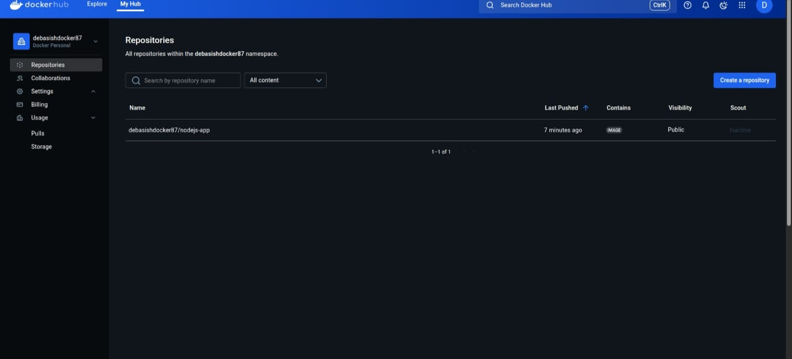
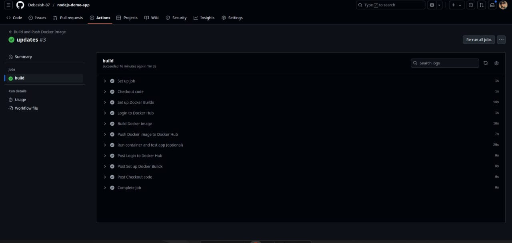

# Node.js Demo App CI/CD Pipeline

This project automates the build, test, and deployment of a Node.js web app using GitHub Actions and Docker.

## Features:
- Node.js web app (prints a message on port 3000)
- CI/CD workflow triggered on push to `main`
- Docker image built and pushed to Docker Hub (`debasishdocker87/nodejs-app`)
- Docker container test in pipeline

## Tech Stack:
- GitHub Actions
- Docker
- Node.js

## How to Run:
- Clone the repo
- Push code to `main` branch
- GitHub Actions will handle build & push

